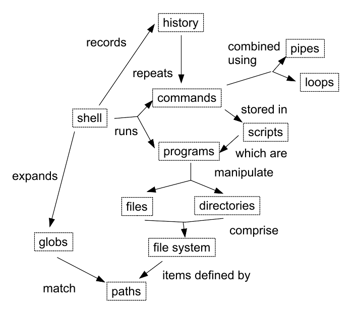

# Designing DataCamp Courses

<em>

This page describes a repeatable process for designing DataCamp courses
that incorporates evidence-based teaching practices.
The design of our introduction to the Unix shell for data scientists is used as a running example;
please use [this Markdown template](template.md) as a starting point for your own course designs.

The most important thing about this process is that **it is always iterative**.
The steps are laid out in a particular order,
and the final lesson design should be presented in that order,
but in real life you will frequently go back to revise earlier work
as you learn something from your answer to a later question
or realize that your initial plan isn't going to play out the way you first thought.

</em>

<!-- -------------------------------------------------------------------------------- -->

## Step 1: Who is this lesson for?

<em>

Terms like "beginner" and "expert" mean different things to different people,
and many factors besides pre-existing knowledge influence who a course is suitable for.
The first step in designing a lesson is therefore to make clear who it is intended to help and how,
and the best way to do this is
to explain what [these fictitious people][profile-site] will and won't get out of it.
These profiles have [five parts][learner-profiles]:
the person's general background,
what they already know,
what they think they want to do,
any special needs they might have,
and how the course will help them.
The first four parts are defined by DataCamp;
each instructor should fill in the final part for two or more learner profiles.

Output: brief descriptions of intended audience.

Note: the [learner profiles][profile-site] will be updated as we learn more about our users.
Please do not incorporate the profiles into your course design;
instead,
link to them and comment on how the lesson relates to them.

</em>

### [Jasmine](https://github.com/datacamp/learner-profiles#jasmine)


This course will give Jasmine a basic understanding of the Unix shell
so that she can help her students solve the problems they encounter
using the university's systems in their statistics courses.

### [Thanh](https://github.com/datacamp/learner-profiles#thanh)


This course will show Thanh how to build command-line tools
and use remote computing resources (such as clusters),
and is a step toward building [robust software][robust-software].

### [Yngve](https://github.com/datacamp/learner-profiles#yngve)


Yngve uses all of the tools and concepts that this course introduces on a daily basis,
and so will not be interested in taking it.
If he is required to do so as part of a certification or learning path,
he should be able to do one or two of the final exercises to demonstrate his understanding,
and nothing more.

<!-- -------------------------------------------------------------------------------- -->

## Step 2: How far will this lesson get its learners?

<em>

The best way to make the goal of a course concrete is
to write exercises that test what learners will be able to do at its end.
This is directly analogous to [test-driven development][tdd]:
rather than working forward from a (probably ambiguous) set of learning objectives,
designers work backward from concrete examples of where their learners are going.
(Wrapping-up exercises of this kind are technically called *summative assessments*.)

Output: 1-2 exercises that use most or all of the skills the learner is to develop.

Note: these will normally be included toward the end of the course.
Be sure to include solutions with example code
so that the scope of the exercise is unambiguous.

</em>

You have several dozen data files, each of which is formatted like this:

```
2013-11-05,deer,5
2013-11-05,rabbit,22
2013-11-05,raccoon,7
2013-11-06,rabbit,19
```

1. Write a shell script called `unique.sh`
   that takes any number of filenames as command-line parameters
   and prints the names of the species found in each file
   in alphabetical order.
   Each file is processed separately.

> **Solution**
>
> ```
> #!/usr/bin/env bash
> 
> # Find unique species in CSV files where species is the second data
> # field.  This script accepts any number of filenames as arguments
> # and processes each separately.
> 
> for file in $@ 
> do
>   echo $file
>   cut -d , -f 2 $file | sort | uniq
> done
> ```

2. With one command,
   use `unique.sh` to find the unique species
   in all of the `.csv` files in the `~/archive` and `~/new` directories.
   Use wildcards to specify the names of the files to be processed;
   do *not* include the `.txt` or `.bak` files in those directories.

> **Solution**
>
> ```
> unique.sh ~/archive/*.csv ~/new/*.csv
> ```

<!-- -------------------------------------------------------------------------------- -->

## Step 3: What will the learner's mental model be at the end of the lesson?

<em>

This is a brainstorming stage to determine how learners should think of the subject at the end of the course.
Its concrete output is usually a [concept map][concept-map] showing the main ideas and their relationships,
but in some cases it may be more helpful to represent the goal as a [decision tree][abela-chart]
or some other graphical form.

Output: graphical representation of learner's final mental model.

Note: this step will often be the most unfamiliar to newcomers.
It's usually easiest to sketch the first drafts of your concept map on paper or a whiteboard
rather than using computer drawing tools.

</em>



<!-- -------------------------------------------------------------------------------- -->

## Step 4: What will the learner do along the way?

<em>

*Formative assessments* are exercises done while learning is taking place,
rather than at the end to determine whether it has.
Formative assessments serve two purposes:
to tell the learner and the instructor if learners are making progress
(or conversely, what they still need to work on),
and to give learners a chance to exercise the skills and knowledge
they will need in the summative assessment.

To create formative assessments,
work backward from the summative assessment written in Step 2 (Summative Assessment).
Make a point-form list of the skills needed to solve the summative assessment
and create a formative assessment for each,
then itemize the extra skills those exercises depend on,
and repeat until every concept and connection in the concept map (Step 3) is covered.

Output: 5-10 exercises that use the skills you intend to teach.
These will help communicate the concrete goals of the course to others,
and help you uncover dependencies you didn't realize you had.

Notes:

* These will normally be included in the finished course.
* They are **not** all of its exercises,
  but rather milestones along the way (typically 2-3 per chapter).
* Do not worry about their order;
  you will do that in the next step.
* As with summative assessment,
  be sure to include solutions with example code
  so that the scope of each exercise is unambiguous.

</em>

### Manipulating Files and Directories

What is the output of the final `ls` command in the sequence shown below?

```
$ pwd
/Users/jasmine/data

$ ls
mortality.dat

$ mkdir old
$ mv mortality.dat old
$ cp old/mortality.dat ../mortality-saved.dat
$ ls
```

1. `mortality-saved.dat old`
2. `old`
3. `mortality.dat old`
4. `mortality-saved.dat`

Uses:
- `pwd`, `ls`, `cp`, `mv`, `mkdir`
- paths
- the special path `..`

### Wildcards

Suppose you want to delete the output files in the `results` directory
and any raw files that have mistakenly been copied into the current directory
without deleting anything else.
The raw files' names end in `.dat` and the processed files' names end in `.out`.
Which of the following would do what you want?

1. `rm results/* .raw`
2. `rm results/*.out ~/*.raw`
3. `rm *.dat ?/*.out`
4. `rm ./*.dat results/*.out`

Uses:
- paths
- `*` and `?` wildcards

### Tracing Pipes and Redirection

A file called `dental.csv` contains the following data:

```
2017-05-05,incisor
2017-05-05,bicuspid
2017-05-05,molar
2017-05-06,bicuspid
2017-05-06,incisor
2017-05-06,premolar
2017-05-07,bicuspid
2017-05-07,crown
```

What text passes through each of the pipes and the final redirect in the pipeline below?

```
$ cat dental.csv | head -n 5 | tail -n 3 | sort -t , -k 2 > final.txt
```

Uses:
- `cat`, `head`, `tail`, `sort`
- pipes
- redirection
- command flags

### Selecting Data by Value

A file called `dental.csv` contains 2000 lines formatted as follows:

```
2017,incisor
2017,bicuspid
2016,bicuspid
2016,premolar
2015,bicuspid
2015,crown
...
2000,bicuspid
2000,premolar
```

Write a command that selects *only* the data from the years 2000, 2005, and 2010.

Uses:
- `grep` (with fixed text, not regualr expressions)

### Shell Scripts

Fill in the blanks in the shell script `dates.sh`
to select unique dates from the files
whose names are given as the script's command-line arguments.

Uses:
- command-line arguments
- pipes
- wildcards
- `cut`, `sort`, `uniq`
- `#!`

<!-- -------------------------------------------------------------------------------- -->

## Step 5: In what order will the learner do things?

<em>

In this stage,
the formative assessments are put in an order
that implicitly defines the order of topics in the course.

Output: an ordering for the milestone formative assessments.

Note: this is the point at which you are most likely to discover things you forgot to list earlier,
so don't be surprised if you have to double back a few times.

</em>

The formative assessments in Step 4 (Formative Assessments) are already in order.

<!-- -------------------------------------------------------------------------------- -->

## Step 6: How are the exercises connected?

<em>

Once the milestone formative assessments are sequenced,
you will create a point-form outline of the chapters.
Each chapter has a title and 8-15 exercises,
while each exercise has a handful of keywords describing what it will cover.
This is also when you will consolidate the datasets your formative assessments have used.

Output: an instructional sequence and dataset summary.

Note: it is common to double back and change assessments in this stage
so that they can share datasets,
and/or to modify datasets to make them shareable.

</em>

The chapter and lesson outline is:

1. Manipulating Files and Directories
   1. What a shell is; how it compares to a graphical interface.
   2. `whoami`; `pwd`; `ls`; files vs. directories
   3. cd; the special paths `.` and `..`
   4. `cat`; editing text files with tools like `nano`
   5. `cp`
   6. `mv`; `rm`
   7. `mkdir`; `rmdir`
2. Manipulating Data
   1. `head`; `tail`; command-line flags
   2. `man`
   3. `cut`
   4. `history`; `!number` and `!command`
   5. `grep`; single-quoting arguments to protect special characters
3. Combining Tools
   1. Redirection with `>`
   2. Piping with `|`
   4. Using the `*` and `?` wildcards
   3. `uniq`; `sort`
4. Automating Repeated Tasks
   1. Storing commands in files; running files with `bash script.sh`
   2. Permissions; `ls -l`; changing permissions; using `!#`
   3. Using positional arguments `$1`, `$2`, etc.
   4. Using `$@`
   5. Teaser for the next course in the sequence (shell loops and SSH)

The datasets are:

- `./dental.csv`: two-column year and tooth data
- `./data/*.csv': seasonal dental data ('autumn.csv', 'spring.csv', 'summer.csv', 'winter.csv')

<!-- -------------------------------------------------------------------------------- -->

## Step 7: How will learners find the course and know if it's for them?

<em>

You are now ready to create the course's public interface:

* its learning objectives
* a short blurb for the course catalog
* a summary of its prerequisites

Doing this earlier often wastes effort,
since material is often added, cut, or moved around in Steps 2-6.

Output: learning objectives, course overview, and prerequisites.

Note: see the appendix for a discussion of how to write good learning objectives.

</em>

**Course Description**

The Unix command line has survived and thrived for almost fifty years
because it lets people to do complex things with just a few keystrokes.
Sometimes called "the duct tape of programming",
it helps users combine existing programs in new ways,
automate repetitive tasks,
and run programs on clusters and clouds
that may be halfway around the world.
This course will introduce its key elements
and show you how to use them efficiently.

**Learning Objectives**

- Explain the similarities and differences between the Unix shell and graphical user interfaces.
- Use core Unix commands to create, rename, and remove files and directories.
- Explain what files and directories are.
- Match files and directories to relative and absolute paths.
- Use core data manipulation commands to filter and sort textual data by position and value.
- Find and interpret help.
- Predict the paths matched by wildcards and specify wildcards to match sets of paths.
- Combine programs using pipes to process large data sets.
- Write shell scripts to re-run command pipes with a varying number of command-line arguments.

**Prerequisites**

None.

<!-- -------------------------------------------------------------------------------- -->

## Conclusion

As stated in the introduction,
this process is described as a one-way flow,
but in practice you will loop back repeatedly
as each stage informs you of something you overlooked.
Similarly,
you may add, move, or remove some specific lesson items after you begin writing exercises
(though we must approve any signficant structural changes to the course).
The end product,
though,
should have the flow described above,
since that is the order that will make it easiest for the next person who has to update your course
to understand what it is trying to achieve and why it is organized the way it is.

<!-- -------------------------------------------------------------------------------- -->

## Further Reading

* Huston: *[Teaching What You Don't Know][huston-teaching]*
* Lang: *[Small Teaching][lang-teaching]*
* Wilson: *[How to Teach Programming (and Other Things)][wilson-teaching]*

<!-- -------------------------------------------------------------------------------- -->

## Appendix: Writing Good Learning Objectives

To write a good learning objective:

1. Identify the *main noun* (the thing you want learners to master).
2. Identify the *level of understanding* you want (discussed below).
3. Select an *observable verb*.
   "Learner will understand X" isn't observable (at least, not until telepathy is productized),
   but "learner will describe key points in the development of X" is.

The most widely used classification of levels of understanding is [Bloom's Taxonomy][bloom].
Its six levels and associated verbs are:

1. Knowledge: recalling learned information
   (name, define, recall).
2. Comprehension: explaining the meaning of information
   (restate, locate, explain, recognize).
3. Application: applying what one knows to novel, concrete situations
   (apply, demonstrate, use).
4. Analysis: breaking down a whole into its component parts
   and explaining how each part contributes to the whole
   (differentiate, criticize, compare).
5. Synthesis: assembling components to form a new and integrated whole
   (design, construct, organize).
6. Evaluation: using evidence to make judgments about the relative merits of ideas and materials
   (choose, rate, select).

[abela-chart]: http://extremepresentation.typepad.com/.shared/image.html?/photos/uncategorized/choosing_a_good_chart.jpg
[bloom]: https://en.wikipedia.org/wiki/Bloom's_taxonomy
[concept-map]: http://third-bit.com/teaching/memory.html#concept-maps
[huston-teaching]: https://www.amazon.com/Teaching-What-You-Dont-Know/dp/0674035801/
[lang-teaching]: https://www.amazon.com/Small-Teaching-Everyday-Lessons-Learning/dp/1118944496/
[learner-profiles]: http://third-bit.com/teaching/lessons.html#learner-profiles
[profile-site]: https://github.com/datacamp/learner-profiles
[robust-software]: http://journals.plos.org/ploscompbiol/article?id=10.1371/journal.pcbi.1005412
[swc-teaching]: https://swcarpentry.github.io/instructor-training/
[tdd]: https://en.wikipedia.org/wiki/Test-driven_development
[wilson-teaching]: http://third-bit.com/teaching/
